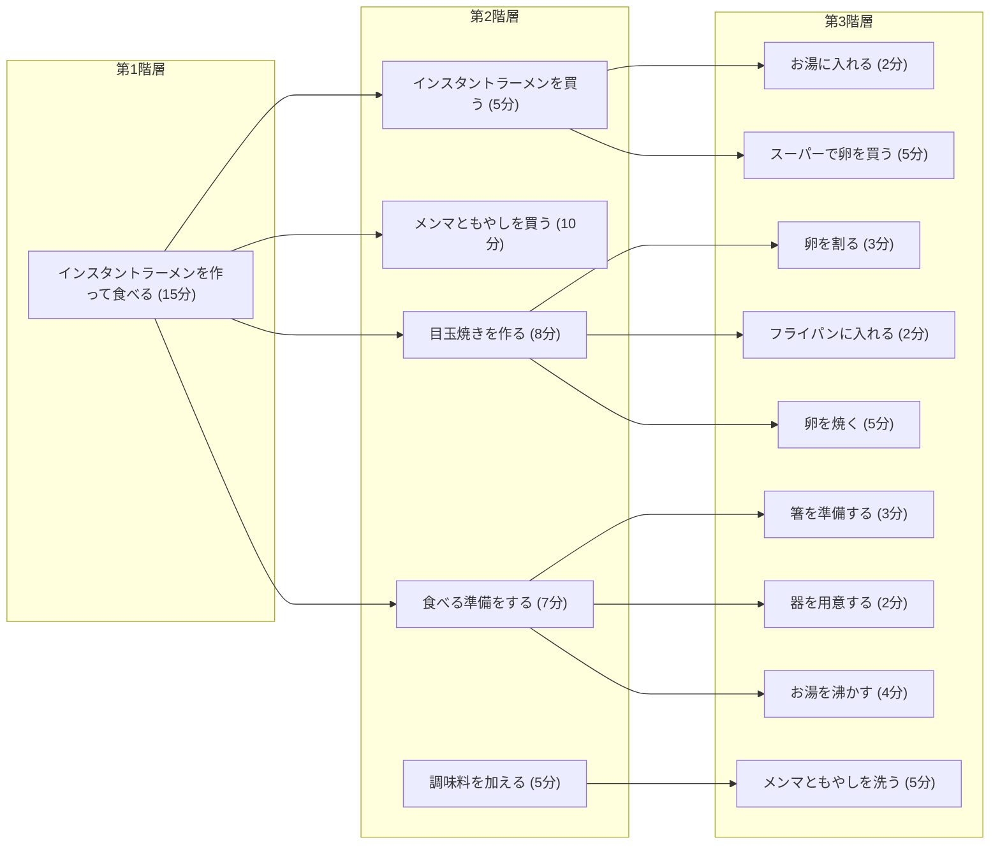

```mermaid
graph LR;

subgraph "第1階層"

    make_and_eat_instant_ramen["インスタントラーメンを作って食べる (15分)"]

end

subgraph "第2階層"

    bay_Instant_noodle["インスタントラーメンを買う (5分)"]

    goto_market["メンマともやしを買う (10分)"]

    cook_eggs["目玉焼きを作る (8分)"]

    prepare_to_eat["食べる準備をする (7分)"]

    add_condiments["調味料を加える (5分)"]

end


subgraph "第3階層"

    goto_bank["お湯に入れる (2分)"]

    goto_super["スーパーで卵を買う (5分)"]

    wash_eggs["卵を割る (3分)"];

    put_in_frying_pan["フライパンに入れる (2分)"]

    fry_eggs["卵を焼く (5分)"]


    do_situps["箸を準備する (3分)"]

    crack_the_shell["器を用意する (2分)"]

    sprinkle_wit_salt["お湯を沸かす (4分)"]

    add_condiments--->wash_vegetables["メンマともやしを洗う (5分)"];

end


%% 第1階層から第2階層へ

make_and_eat_instant_ramen--->bay_Instant_noodle;

make_and_eat_instant_ramen--->goto_market;

make_and_eat_instant_ramen--->cook_eggs;

make_and_eat_instant_ramen--->prepare_to_eat;


%% 第2階層から第3階層へ

bay_Instant_noodle--->goto_bank;

bay_Instant_noodle--->goto_super;

cook_eggs--->wash_eggs;

cook_eggs--->put_in_frying_pan;

cook_eggs--->fry_eggs;


prepare_to_eat--->do_situps;

prepare_to_eat--->crack_the_shell;

prepare_to_eat--->sprinkle_wit_salt;


```