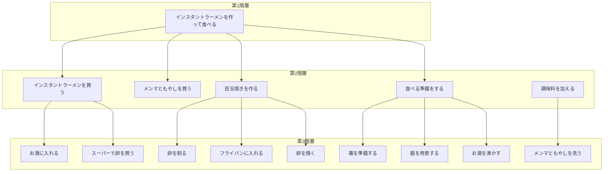

```mermaid
flowchart TB

subgraph "第1階層"

    make_and_eat_instant_ramen["インスタントラーメンを作って食べる"]

end

subgraph "第2階層"

    bay_Instant_noodle["インスタントラーメンを買う"]

    goto_market["メンマともやしを買う"]

    cook_eggs["目玉焼きを作る"]

    prepare_to_eat["食べる準備をする"]

    add_condiments["調味料を加える"]

end


subgraph "第3階層"

    goto_bank["お湯に入れる"]

    goto_super["スーパーで卵を買う"]


    wash_eggs["卵を割る"];

    put_in_frying_pan["フライパンに入れる"]

    fry_eggs["卵を焼く"]


    do_situps["箸を準備する"]

    crack_the_shell["器を用意する"]

    sprinkle_wit_salt["お湯を沸かす"]

    add_condiments--->wash_vegetables["メンマともやしを洗う"];

end


%% 第1階層から第2階層へ

make_and_eat_instant_ramen--->bay_Instant_noodle;

make_and_eat_instant_ramen--->goto_market;

make_and_eat_instant_ramen--->cook_eggs;

make_and_eat_instant_ramen--->prepare_to_eat;


%% 第2階層から第3階層へ

bay_Instant_noodle--->goto_bank;

bay_Instant_noodle--->goto_super;

cook_eggs--->wash_eggs;

cook_eggs--->put_in_frying_pan;

cook_eggs--->fry_eggs;


prepare_to_eat--->do_situps;

prepare_to_eat--->crack_the_shell;

prepare_to_eat--->sprinkle_wit_salt;


```