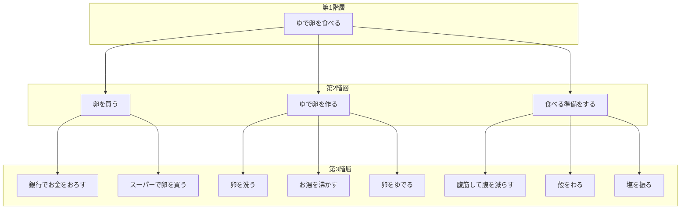

```mermaid

flowchart TB

subgraph "第1階層"

    eat_boid_eggs["ゆで卵を食べる"]

end

subgraph "第2階層"

    bay_eggs["卵を買う"]

    cook_boil_eggs["ゆで卵を作る"]

    prepare_to_eat["食べる準備をする"]

end


subgraph "第3階層"

    goto_bank["銀行でお金をおろす"]

    goto_super["スーパーで卵を買う"]


    wash_eggs["卵を洗う"];

    boil_hotwater["お湯を沸かす"]

    boil_eggs["卵をゆでる"]


    do_situps["腹筋して腹を減らす"]

    crack_the_shell["殻をわる"]

    sprinkle_wit_salt["塩を振る"]

end


%% 第1階層から第2階層へ

eat_boid_eggs--->bay_eggs;

eat_boid_eggs--->cook_boil_eggs;

eat_boid_eggs--->prepare_to_eat;


%% 第2階層から第3階層へ

bay_eggs--->goto_bank;

bay_eggs--->goto_super;


cook_boil_eggs--->wash_eggs;

cook_boil_eggs--->boil_hotwater;

cook_boil_eggs--->boil_eggs;


prepare_to_eat--->do_situps;

prepare_to_eat--->crack_the_shell;

prepare_to_eat--->sprinkle_wit_salt;
```