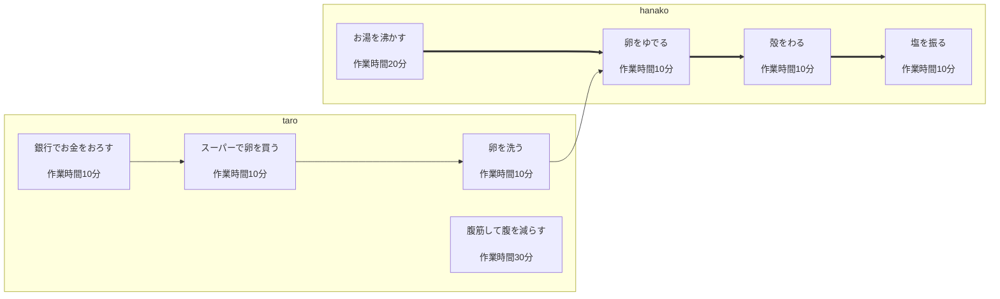

```mermaid

graph LR;

    goto_bank["銀行でお金をおろす

                  作業時間10分"]

    goto_super["スーパーで卵を買う

                  作業時間10分"]

    wash_egg["卵を洗う

              作業時間10分"]

    boil_hotwater["お湯を沸かす

              作業時間20分"]

    boil_eggs["卵をゆでる

              作業時間10分"]

    crack_the_shell["殻をわる

              作業時間10分"]

    sprinkle_wit_salt["塩を振る

              作業時間10分"]

    do_situps["腹筋して腹を減らす

                作業時間30分"]


%% 太郎のフロー

subgraph "taro"

 direction LR

 goto_bank--->goto_super--->wash_egg;


   do_situps

end


%% 花子のフロー

subgraph "hanako"

 boil_hotwater===>boil_eggs===>crack_the_shell===>sprinkle_wit_salt;

end


%% サブグラフをまたがったライン

 wash_egg--> boil_eggs


```